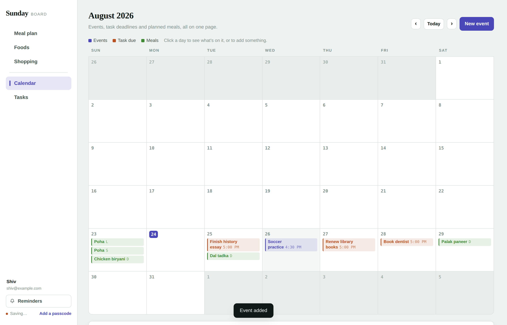
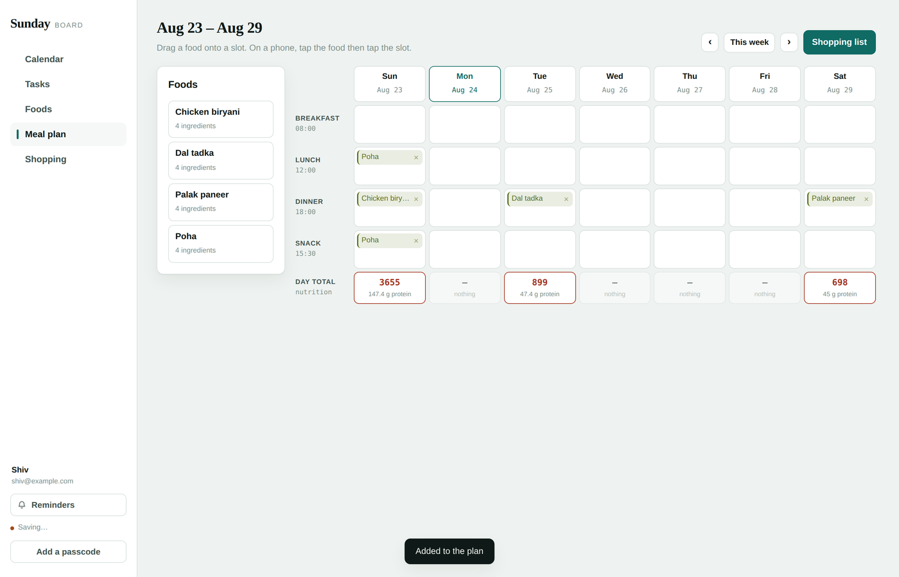
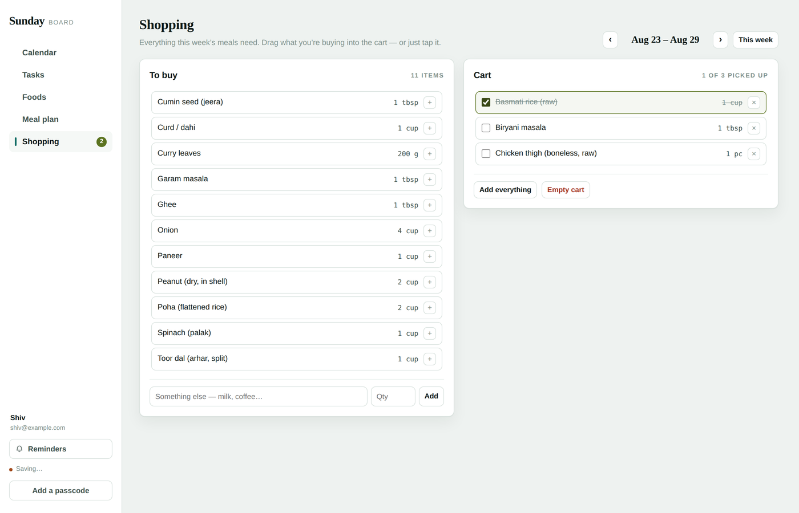
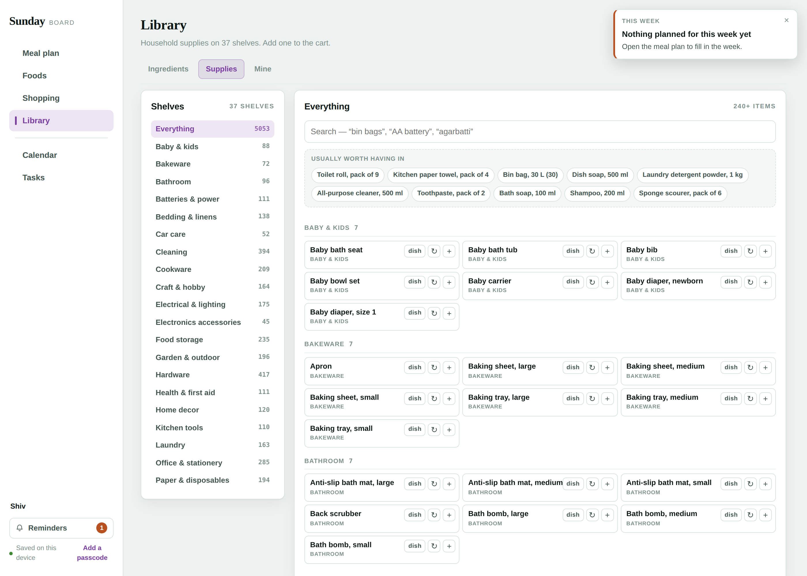
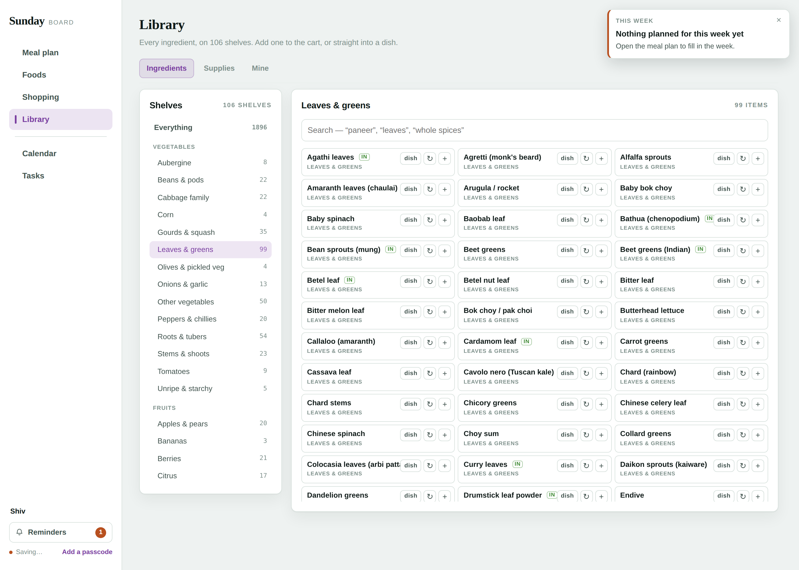
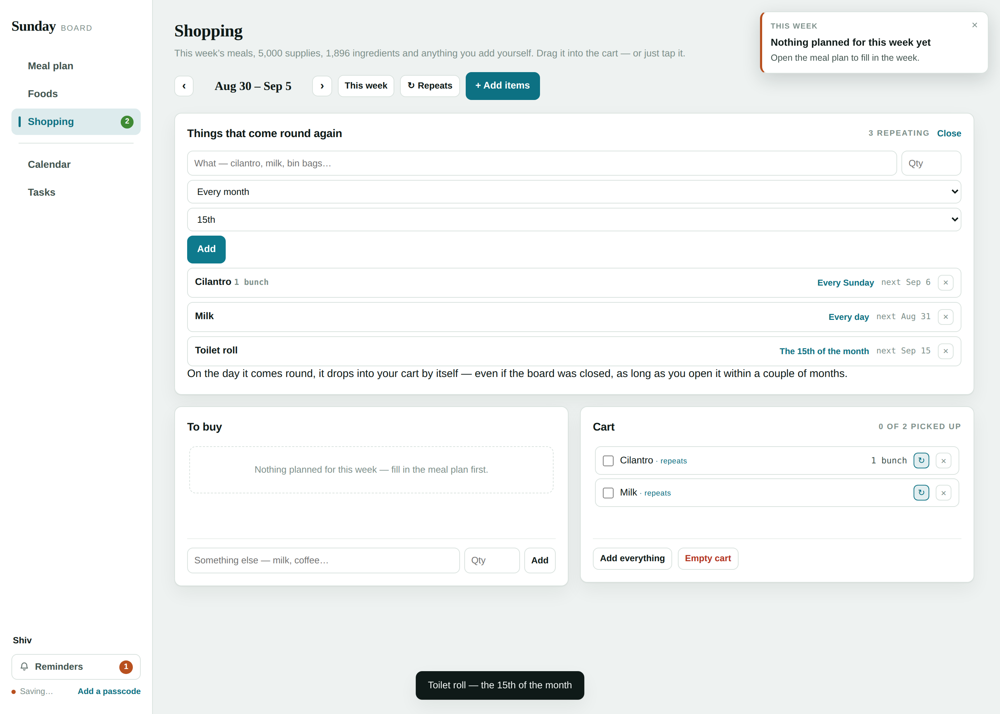
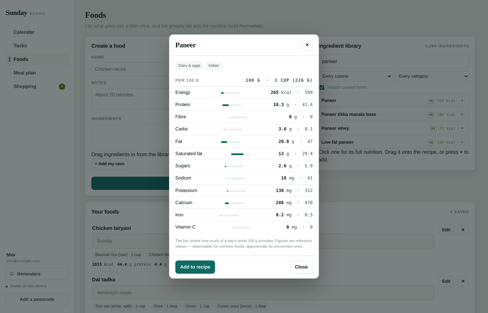
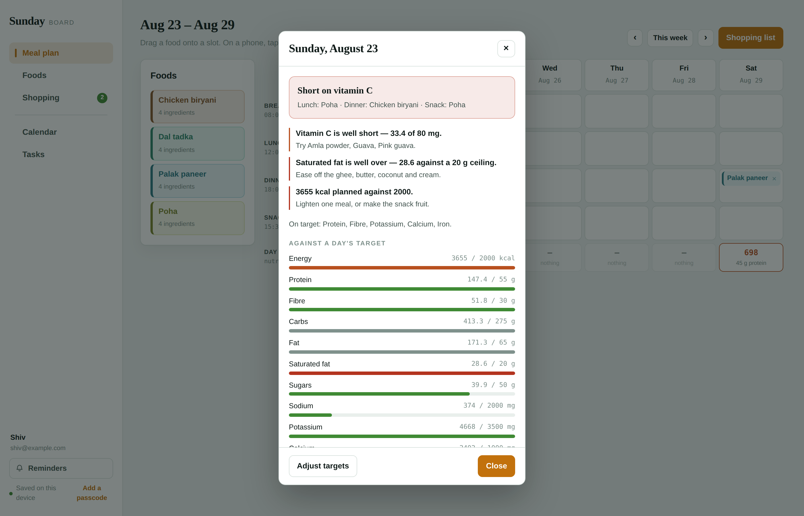

# Sunday Board

A calendar, task list, meal planner and shopping cart in one page. No build step
to run it, no server, no accounts, no dependencies — open `index.html` and it works.

It plans the week's meals, works out what to buy from the ingredients, adds up the
quantities, and tells you roughly what you're eating.



## What it does

**Calendar** — events with a time and notes. Task deadlines and planned meals show
up alongside them. Click a day to see what's on it.

**Tasks** — due date, time, notes, done. Anything with a due date lands on the calendar.

**Foods** — build a dish once from the ingredient library, and its nutrition and
grocery contribution follow it everywhere.

**Meal plan** — a week grid with breakfast, lunch, dinner and snack. Drag a food onto
a slot, or tap on a phone. Each day shows its calories and protein; click through for
the full read-out.



**Shopping** — the week's ingredients with quantities added up. Drag what you're
buying into the cart and tick things off as you go.

**Library** — a page of shelves, not a search box hidden behind a button. Three
tabs: all 1,896 **Ingredients** on 106 shelves grouped under the 17 aisles they
belong to, 5,053 **Supplies** on 37 shelves, and **Mine** — anything you add
yourself, on shelves you name. Every row goes to the cart, straight into a dish,
or onto a repeat.

**Repeats** — give something a frequency and it arrives on its own. Cilantro every
Monday, milk every day, toilet roll on the 15th. The board can't run while it's
closed, so it looks backwards when you open it: the most recent due date that hasn't
been served yet gets served now, up to two months back.

**Suggestions** — what you buy most often, the ingredients your own dishes lean on,
and which dish to cook again. All of it read off your own history; before there is
any, it falls back to the things most kitchens run out of.









**Reminders** — one day before and thirty minutes before every event, task and meal,
plus a Sunday summary of the week's menu and shopping. They appear in the page and,
if you allow it, as desktop notifications. They fire while the page is open, and
anything missed in the last twelve hours is waiting when you come back.

## The ingredient library

5,299 ingredients across 27 cuisines, each with twelve nutrients per 100 g: energy,
protein, fibre, carbs, fat, saturated fat, sugars, sodium, potassium, calcium, iron
and vitamin C.



**1,896 of those are written out** in `src/data/ingredients.txt`, one per line:

```
name|group|kcal|protein|carb|fibre|sugar|fat|satfat|sodium|potassium|calcium|iron|vitC|units|cuisines
Toor dal (arhar, split)|Dals & pulses|343|22.3|62.8|15.5|2.8|1.7|0.4|17|1392|130|5.2|0|cup=200,tbsp=12|in
```

**The other 3,403 are cooked forms, derived at load time** — *boiled*, *grilled*,
*roasted*, *sautéed*, *deep-fried*, *steamed* — using yield and nutrient-retention
factors, the same approach food composition tables use. Dry toor dal is 343 kcal per
100 g; boiled it is about 127, because it nearly triples in weight. Raw potato is 77;
deep-fried it is 223, with the cooking oil counted in. Water-soluble vitamins drop
where they leach. Every derived entry says on its own card how it was worked out.

They are estimates, not measurements — dependable for common foods, approximate for
uncommon ones. The app says so where it matters. It is not medical advice.



## Running it

Open `index.html`. That's it.

To serve it locally:

```bash
python3 -m http.server 8099
# then http://localhost:8099/
```

To host it, push this repo and turn on GitHub Pages (Settings → Pages → deploy from
`main`, root). `index.html` sits at the root, so nothing else is needed.

## Editing it

`index.html` is generated. Edit `src/sunday-board.html` — it carries a
`__INGREDIENT_TABLE__` placeholder so the page stays readable without 1,896 lines of
data in the middle of it — then:

```bash
python3 src/build.py
```

That injects the table and writes a standalone `index.html`.

## Tests

Real-browser tests through Playwright, asserting on what the page actually renders.
See [`tests/README.md`](tests/README.md). Serve over HTTP rather than `file://` —
browsers partition storage differently for file origins and the reminder tests give
false failures there.

## Where your data lives

In your browser, under `localStorage`, on the device you're using. Nothing is sent
anywhere.

The sign-in screen takes a name and an email, and offers an optional passcode. The
passcode is real: it derives an AES-256 key with PBKDF2 and encrypts the saved board,
so what's on disk is ciphertext. There is no reset — forget it and the board is gone,
which is why it's off by default.

## Layout

```
index.html              the whole app, generated — open this
src/sunday-board.html   the source page
src/build.py            injects both data tables, writes index.html
src/data/ingredients.txt  1,896 ingredients, pipe-delimited
src/data/supplies.txt     5,053 household supplies, pipe-delimited
src/gen_supplies.py       regenerates supplies.txt
tests/                  Playwright tests
docs/                   screenshots
```

## Categories

The 17 groups the ingredient data ships with are too coarse to browse — "Vegetables"
is 368 things. `subCategory()` in the page sorts every ingredient into one of **106
finer categories** you would actually go looking for: Leaves & greens, Gourds &
squash, Whole spices, Cured meats & sausages, Roots & tubers, Souring agents. They
are the shelves on the Library page, sorted under their aisle, and they work in
search too — typing `leaves` returns the whole leaf shelf, not just the things with
"leaf" in the name.

Supplies carry their 37 categories in the data file. Your own items carry whichever
category you file them under, new ones included.

## The supply library

5,053 household supplies in `src/data/supplies.txt`, one per line:

```
name|category|unit|tags
Bin bag, 30 L (30)|Cleaning|roll|
Agarbatti (incense sticks)|Pooja & festival|each|in
AA alkaline battery, pack of 8|Batteries & power|pack|
```

37 categories, from **Cleaning** and **Hardware** through **Plumbing**, **Office &
stationery**, **Pooja & festival**, **Pet supplies**, **Garden & outdoor** and
**Baby & kids**. `tags` marks the Indian-household staples. No nutrition here — a
supply is a thing you buy, not a thing you eat, so it carries a category and a
purchase unit and nothing more.

Regenerate it with `python3 src/gen_supplies.py`. The generator is the source of
truth: it holds the item lists and the size and pack variants they expand into.

## Known limits

- Reminders need the page open. A browser tab can't wake itself up; anything missed
  in the last twelve hours appears when you return.
- Nutrition covers ingredients from the library. Anything you type in yourself isn't
  counted, and the app says how many were left out rather than pretending otherwise.
- One board per browser. There's no sync between devices.
